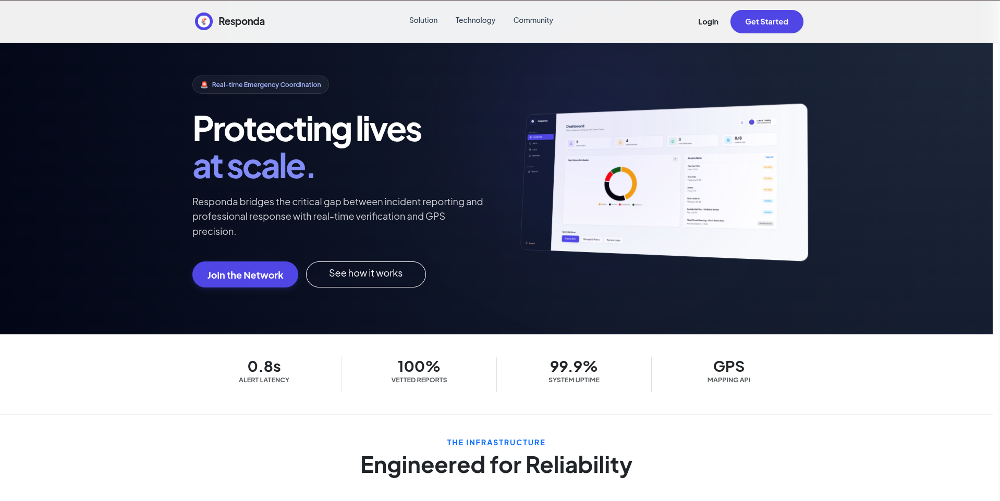
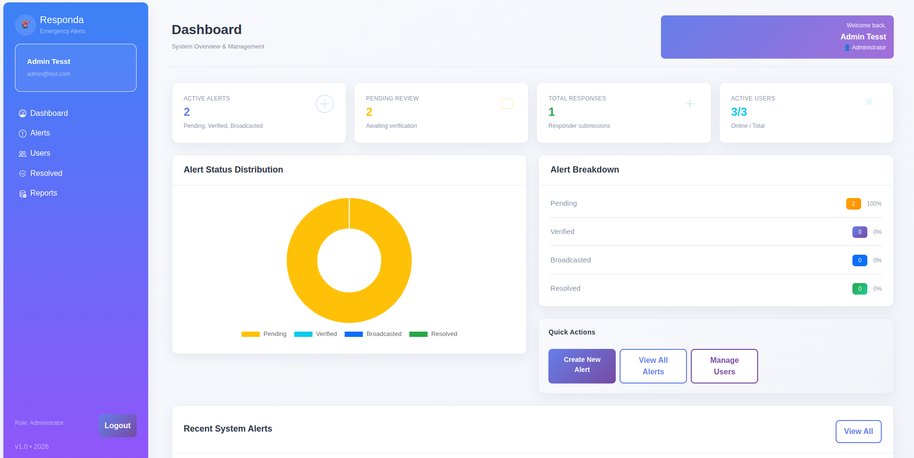
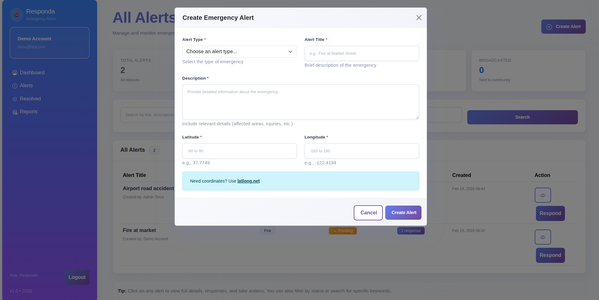
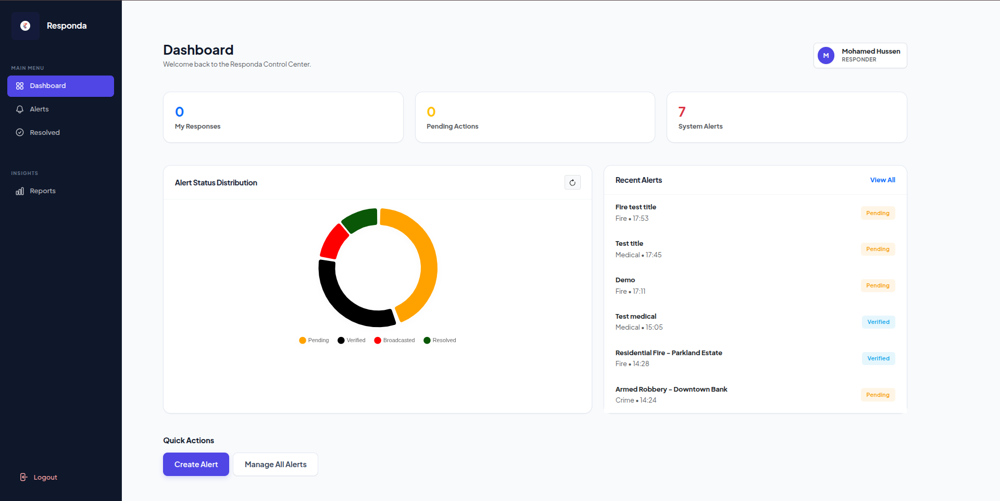

# Responda – `Community Emergency Alert & Response System`

[](https://opensource.org/licenses/MIT)
[]()
[]()
[]()
[]()

## Overview
**Responda** is a **community emergency alert and response system** designed to help communities report, track, and manage emergency incidents in real time.

The platform enables citizens to submit emergency alerts while allowing responders and administrators to verify, monitor, and coordinate responses more efficiently through a centralized digital system.

This project is built to demonstrate how technology can improve **public safety communication**, **incident reporting**, and **emergency coordination**.


## Project Highlights
- Built a **role-based emergency reporting and response platform**
- Supports **incident reporting, verification, tracking, and management**
- Designed for both **web and mobile integration**
- Includes **admin dashboard, responder workflows, and user management**
- Focused on improving **community safety and emergency coordination**


## Why I Built This
In many communities, emergency incidents are often reported through **informal channels**, delayed phone calls, or fragmented communication systems.

This can slow down response time and reduce visibility into what is happening on the ground.

I built **Responda** to create a more **organized, trackable, and responsive emergency reporting system** that helps connect the public, responders, and administrators in one platform.


## My Role
I designed and developed this project as a **full-stack web and mobile-ready system**, focusing on:

- Backend logic and system workflows
- Database design and incident data management
- Frontend interfaces for reporting and dashboard access
- Role-based access for admins and responders
- Incident CRUD functionality
- System architecture to support future real-time notifications and mobile integration


## Core Skills Demonstrated
- Full-stack web application development
- Role-based access control
- CRUD operations
- Database design and management
- Admin dashboard development
- Incident workflow system design
- Responsive frontend implementation
- API-ready backend structure
- Public service / civic tech solution design


## Key Features

### Emergency Reporting
- **Incident Submission**
  Users can report emergency cases through the platform.

- **Structured Incident Records**
  Capture emergency details in a structured and trackable format.

- **Centralized Alert System**
  Helps organize and monitor alerts from one place.

### Role-Based Access
- **Admin Access**
  Administrators can manage users, monitor incidents, and review system activity.

- **Responder Access**
  Responders can view, track, and manage assigned emergency reports.

- **Secure User Management**
  Supports controlled access to different system roles.

### Dashboard & Monitoring
- **Admin Dashboard**
  Displays system statistics, reported incidents, and response tracking.

- **Incident Status Tracking**
  Monitor alert progress from report to response stage.

- **Operational Visibility**
  Helps improve coordination and accountability in emergency handling.

### System Architecture
- **Web + Mobile Ready**
  Built to support both web and future mobile integration.

- **Planned Real-Time Notifications**
  Designed with future support for Firebase notifications and real-time updates.


## Tech Stack

### Backend
- PHP
- REST API structure

### Frontend
- HTML5
- CSS3
- Bootstrap
- JavaScript

### Mobile Integration
- React Native

### Database
- MySQL

### Planned Integrations
- Firebase Notifications


## Screenshots


| 1. Landing Page | 2. Admin Dashboard |
| :---: | :---: |
|  |  |

| 3. Incident Reporting | 4. Responder Panel |
| :---: | :---: |
|  |  |


## Installation & Setup

### 1. Clone the Repository
```bash
git clone https://github.com/your-username/responda.git
```

### 2. Move Project to Server Directory
Move the project folder to your local server directory.

Example for XAMPP:
```bash
C:/xampp/htdocs/responda
```

### 3. Start Local Server
Start the following services:

- **Apache**
- **MySQL**

### 4. Create Database
Open **phpMyAdmin** and create a new database:

```sql
responda
```

### 5. Import Database
Import the SQL file from the project’s database folder.

### 6. Configure Database Connection
Update your database credentials inside the config file.

### 7. Run the Project
Open your browser and visit:

```bash
http://localhost/responda
```


## Project Structure

```text
├── config/             # Database and app configuration
├── css/                # Custom styles
├── js/                 # Frontend scripts
├── database/           # SQL files
├── screenshots/        # Project preview images
├── inc/                # Reusable components
├── api/                # API endpoints (if available)
├── mobile/             # React Native integration files (if separated)
└── *.php               # Core application modules
```


## Possible Future Improvements
- Real-time emergency notifications
- GPS/location-based incident reporting
- SMS/WhatsApp emergency alerts
- Push notifications with Firebase
- Mobile app deployment
- Incident heatmap and analytics
- File/photo upload for emergency evidence
- Multi-agency emergency coordination support


## Use Case
This system can be adapted for:

- Community safety programs
- County emergency response teams
- Campus emergency systems
- Disaster reporting platforms
- Local security coordination systems
- Civic tech/public safety initiatives


## Contributing
Contributions are welcome.

If you'd like to improve the system:

1. Fork the repository  
2. Create a feature branch  
   ```bash
   git checkout -b feature/AmazingFeature
   ```
3. Commit your changes  
   ```bash
   git commit -m "Add AmazingFeature"
   ```
4. Push to your branch  
   ```bash
   git push origin feature/AmazingFeature
   ```
5. Open a Pull Request


## Author
**Eric Nzyoka**  
Software & Systems Developer  

- GitHub: [Nzyoka](https://github.com/nzyoka500)
- LinkedIn: [Eric Nzyoka](https://www.linkedin.com/in/ericnzyoka)
- Email: mnzyokaeric@gmail.com


## License
This project is licensed under the **MIT License**.