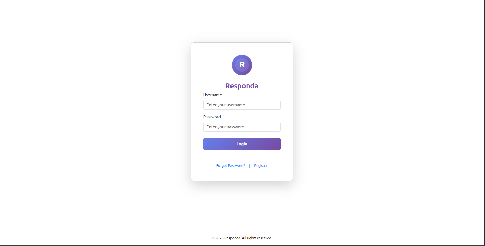

# Responda

## Project Overview
**Responda** is a simple web-based Community Emergency Alert and Response System developed as a final year project.

The system allows administrators and responders to:

- Create emergency alerts
- Target specific locations
- Monitor alert activity
- Manage users

> The project focuses on simplicity, reliability, and clean system architecture.


## System Purpose

Responda is designed to:

- Provide early warning during emergencies
- Improve coordination between responders
- Enhance community safety
- Support future mobile alert integration


## Tech Stack

### Frontend
- HTML
- CSS
- Bootstrap 5
- JavaScript (Vanilla)

### Backend
- PHP (Vanilla)
- MySQL


## Core Features

- Role-based authentication (Admin, Responder)
- Create and manage emergency alerts
- Alert status lifecycle (Pending → Verified → Resolved)
- Location-based alert tracking
- Dashboard for monitoring system activity
- Responder action tracking


## Screenshots

### 🔐 Login Page


### 📊 Dashboard


### 🚨 Create Alert Page


### 📋 Alert Management


> Screenshots will be added after UI implementation.


## Future Extensions

- Flutter Mobile Application (Android)
- Firebase Push Notifications (FCM)
- GPS Location Integration
- REST API for mobile communication
- Real-time alert broadcasting


## Project Structure

```bash

responda/
│
├── public/                     # Main web pages (Admin & Responder)
│   ├── index.php               # Login page
│   ├── dashboard.php           # Dashboard
│   ├── create_alert.php        # Create alert
│   ├── alerts.php              # View alerts
│   ├── users.php               # Manage users
│   └── logout.php
│
├── api/                        # Mobile App API (JSON responses)
│   ├── login.php               # Mobile login
│   ├── get_alerts.php          # Fetch alerts
│   ├── create_alert.php        # Report alert (mobile)
│   ├── update_status.php       # Responder updates
│   └── config.php              # API DB connection
│
├── includes/                   # Reusable components
│   ├── header.php
│   ├── footer.php
│   ├── sidebar.php
│   └── db.php                  # Database connection
│
├── assets/                     # Static files
│   ├── css/
│   ├── js/
│   └── images/
│
├── database/
│   └── responda.sql            # Full database schema
│
├── screenshots/                # README screenshots
│
├── README.md
└── .gitignore


```


## Author

**Alexander Ramadan Tarjan**  

> Final Year Project – 2026

